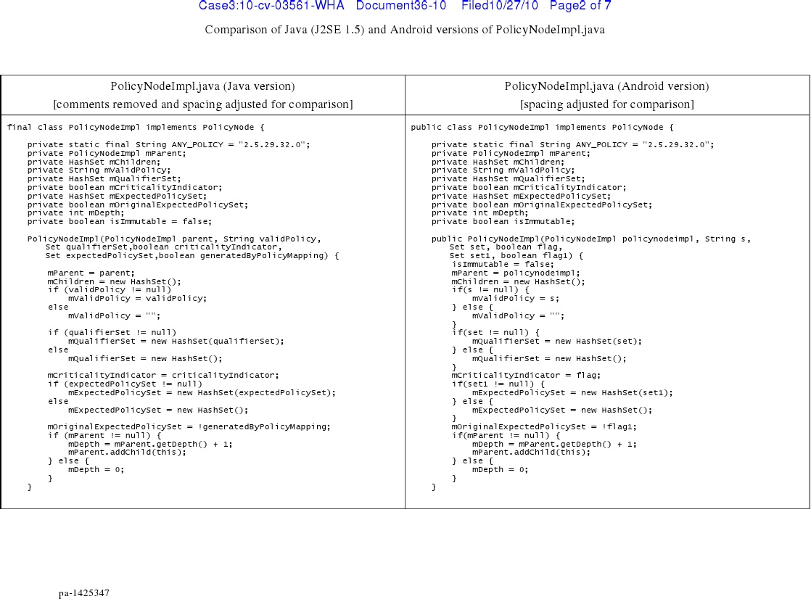

# Nothing Is Implied: a Comprehensive Survey of Software Litigation and Open Source Licensing in the United States
January 2018

by [R. Miles McCain](https://rmrm.io)

---

_This article is not legal advice, and nothing in it should be interpreted as such. A general familiarity with the fundamentals of computer science and the United States justice system is assumed. For case subsections, all factual information is drawn directly from the case proceedings. Legal references `look like this`, and cases are linked in their respective headers._

---

# Abstract
In the United States, many legal mechanisms govern the distribution of computer software, notably patents, copyright, liability, and warranty. The open source community uses a variety of licenses to allow the public to use its software freely. This survey of open source law finds that many of these licenses only explicitly address a small portion of these legal mechanisms, leaving the software's licensing ambiguous and subject to potential restrictions. GPLv3 and the Apache 2.0 license are the most secure and unambiguous licenses, while the MIT license and GPLv2 leave important legal mechanisms governing open source software unaddressed.

# Introduction
The well-being of the open source community is predicated on the free sharing of software. For the open source community to thrive, it must ensure that its participants—contributors to software and the users of that software alike—are legally guaranteed the right to use, share, and modify the software.

Four major legal mechanisms restrict the free flow of software. _Patents_ allow companies to claim temporary exclusive rights to technologies independent of their software implementation. _Copyright_ prevents the unauthorized redistribution or use of software—compiled or otherwise. _Warranty_ and _liability_ hold software contributors legally liable for problems caused by their projects. In order for software projects to maintain their freedom in the face of these legal mechanisms, the projects use _open source software licenses_.

While not all open source licenses are the same, all open source licenses do share the common goal of ensuring that the rights of contributors and users to use, modify, and distribute the software are not restricted or otherwise burdened by litigation. Some licenses may require that derivative works and connected software be similarly licensed ("copyleft"), while others may place few—if any—restrictions on how the software may be used.

The four most [common](https://github.com/blog/1964-open-source-license-usage-on-github-com) open source licenses are, in decreasing order of popularity, the [MIT license](https://opensource.org/licenses/MIT), the [GNU General Public License version 2](https://opensource.org/licenses/GPL-2.0) (GPLv2), the [Apache 2.0 License](https://opensource.org/licenses/Apache-2.0) (Apache 2.0), and the [GNU General Public License version 3](https://opensource.org/licenses/GPL-3.0) (GPLv3). The MIT license and Apache 2.0 are permissive, while the GNU licenses (GPLv2 and GPLv3) are copyleft.

This article will perform a comprehensive survey of the case law pertaining to the four mechanisms of software control—patent, copyright, warranty, and liability—in order to understand the legal strengths and weaknesses of the four most common open source licenses. Special attention will be given to the enforceability of each license, the historical and legal intricacies of the legal mechanisms they address, and current cases and controversies.

**Patent, copyright, liability, and warranty are complex legal mechanisms that control the distribution, modification, and use of software. In order to be effective in securing the free or open use of software, an open source license must explicitly define terms to protect against all four mechanisms. Unfortunately, not all open source licenses do: the MIT license and GPLv2 leave important legal considerations regarding patent and trademark unaddressed, leaving users _and_ contributors vulnerable to litigation.**

# Patent Law
Patents allow for ideas and processes—for example, user interfaces, API design patterns, and complex algorithms—to be owned and protected independently of their technical implementation. First defined in the United States Constitution (`Art. I § 8.8`), patents are an integral part of intellectual property law. They provide inventors with a temporary monopoly ([typically lasting twenty years](https://www.uspto.gov/patent/laws-and-regulations/patent-term-calculator)) to their idea, during which no one else may use the idea without explicit permission from the patent holder. If a patent is infringed, the patent holder may sue for patent infringement and order that the infringer cease their use of the patented idea.

The precedents of patent law were first set in a world without software. The framers of the Constitution could not possibly have imagined today's digital world, and this disconnect is visible when assessing software patent case law. In the early 1970's, when the first software patent court cases arose, it was unclear whether software was even eligible for a patent. Since then, various cases have concretely extended patent law to the digital world.

Today, patents are applicable to software (see `DDR Holdings, LLC v. Hotels.com, L.P.` below; see also [`Enfish LLC v. Microsoft, Inc.`](https://scholar.google.com/scholar_case?case=14524935561110783952&hl=en&as_sdt=6&as_vis=1&oi=scholarr)). Because patent infringement can lead to both a fine and a legal order to cease use of the patented material, open source licenses should explicitly address patents to ensure that licensed software remains available for free use. In order to understand how software licenses can address patents, however, it is necessary to first understand the legal precedents regarding software patents themselves.

## Precedent
### [`Gottschalk v. Benson`](https://www.oyez.org/cases/1972/71-485) (1972)
In 1972, Commissioner of Patents Robert Gottschalk challenged the validity inventor Gary Benson's patent: the process by which numbers in decimal notation could be transformed into binary notation. Benson claimed that all uses of his algorithm—be they automated by a computer or performed by hand—were subject to his patent. Calling the patented algorithm nothing more than a "law of nature," the court ruled against Benson and declared the patent invalid. Benson appealed, and eventually the case appeared before the Supreme Court.

There was little precedent at the time as to whether a computer algorithm could be patented. In 1939 the Supreme Court ruled that mathematical expressions and equations could not be patented (see `[Mackay Co. v. Radio Corp.](https://supreme.justia.com/cases/federal/us/306/86/case.html), 306 U.S. 86`), but Benson argued that his patent was not an _expression or equation_ but rather a new _process_—a particular way of solving an equation, so to speak. The distinction was lost on the Supreme Court justices, however, and they upheld the lower court's decision. Algorithms, they ruled, could not be patented.

The significance of this decision could not have been anticipated in 1972. Computers had yet to revolutionize the world, and many of the intricacies of modern programming had not been invented. As computers began to occupy increasingly important roles in the world of business, though, companies began to worry whether their software—which often resulted in no physical change—was patentable.

_See also: [`Parker v. Flook`](https://www.oyez.org/cases/1977/77-642) (1978)_

### [`Diamond v. Diehr`](https://www.oyez.org/cases/1980/79-1112) (1981)
A patent to the "[process] for molding raw, uncured synthetic rubber into cured precision products" using a machine was filed by James Diehr in 1975. Part of the patent was the use of a mathematical equation (the Arrhenius equation) solved by a computer. Unlike in `Benson`, Diehr was not patenting the computer or program itself—instead, he claimed only that collective system was his patent. Initial reviewers of the patent were sufficiently convinced of Diehr's eligibility, and the filing raised few eyebrows—until a later patent examiner argued that the use of a mathematical equation run by a computer made the _entire process_ ineligible for a patent under the Benson ruling.

The case made its way to the Supreme Court. If the justices decided in favor of the examiner, any patent that made use of a mathematical equation—even if only as part of a subprocess—would be ineligible for protection. If the justices filed in favor of Diehr, computer manufacturers would rejoice, now secure in their ability to patent their products incorporating computer software.

In a 5 to 4 decision, the court decided that the process _was_ patentable. The court was careful not to overrule `Benson` and explained that so long as the patent was not itself a "law of nature" and some physical change occurs, a process or machine is patentable. This decision did not entirely secure the future of software patents—today's computers, after all, do not always create physical changes—but it was a vital case that affirmed the patentability of _some_ software.

### [`Arrhythmia Research Technology, Inc. v. Corazonix Corporation`](https://scholar.google.com/scholar_case?case=204952289152101012&q=Arrhythmia+Research+Technology,+Inc.+v.+Corazonix+Corporation&hl=en&as_sdt=2006&as_vis=1) (1992)
Following `Diehr` in 1981, processes that used a computer as a part of some larger process were patentable. As computers became increasingly capable and prevalent over the following decade, however, not all uses of computers resulted in some physical process. Corazonix Corporation, for example, created a computer device that processed electrocardiographic signals to analyze heart function. At the time of filing, there was no strong precedent as to whether a use-case of a computer was patentable. Arrhythmia Research Technology, a Corazonix competitor, believed that it wasn't.

Importantly, Corazonix did not patent one particular implementation of an electrocardiographic signal processing computer. (Actual software implementations—the source code and object code itself—are firmly protected under copyright.) Instead, Corazonix patented the machine itself—as interpreted, a particular _use case_ of a computer.

`Arrhythmia Research Technology, Inc. v. Corazonix Corporation` was the first major case in which the software patent in question did not result in some tangible physical change. If the court ruled in favor of Corazonix, the patentability of software would be affirmed. If the court ruled in favor of Arrhythmia Research Technology, computer use cases would be ineligible for a patent.

The court ruled in favor of Corazonix and affirmed the eligibility of software for a patent.

### [`Alice Corporation v. CLS Bank International`](https://www.oyez.org/cases/2013/13-298) (2014)
`Arrhythmia` was the law of the land for nearly twenty-two years before the Supreme Court clarified the patentability of software. Following `Diamond v. Diehr` and `Arrhythmia v. Corazonix`, the decision of Benson—that trivial algorithms or computer algorithms are laws of nature—was seemed to be mostly overruled. Vague and abstract software patents were both filed and approved. One such patent was made by CLS Bank, an American financial group, to an electronic escrow service.

CLS Bank's patent was soon challenged, and the high-profile case eventually made it to the Supreme Court. Google, Amazon, and the Electronic Frontier Foundation argued against CLS Bank, saying that abstract software ideas without any specific implementation details could not be patented.

The Supreme Court decided that CLS Bank's patent was not valid, but did not provide a clear benchmark by which trivial "abstract" software patents could be distinguished from non-trivial ones. The ruling declared that patent eligible software must not be "routine," "conventional" or "generic," but did little to define these terms as they related to software. The Washington Post [wrote](https://www.washingtonpost.com/news/the-switch/wp/2014/06/20/the-supreme-courts-decision-on-software-patents-still-doesnt-settle-the-bigger-question/?utm_term=.33bb309294f0) at the time:

> [W]hile the court struck down what was universally said to be a bad patent, it didn't do much to say what kinds of software should be patentable. In other words, the court decided the most basic conflict in the case, but more or less declined to offer guidance for other, future cases.

_See also: [`Bilski v. Kappos`](https://www.oyez.org/cases/2009/08-964), 2010._

### [`DDR Holdings, LLC v. Hotels.com, L.P.`](https://law.justia.com/cases/federal/appellate-courts/cafc/13-1505/13-1505-2014-12-05.html) (2014)
Later in 2014, the Supreme Court would clarify its position regarding software patents. In `DDR Holdings, LLC v. Hotels.com`, the Supreme Court clarified that non-trivial software could still be patented, but patents with entrepreneurial goals (for example, "retaining control over the attention of the customer") as opposed to technical goals were patent ineligible. (This decision was upheld in 2016 by `Enfish LLC v. Microsoft, Inc.`)

More importantly, `DDR Holdings v. Hotels.com` set forth a protocol by which patent eligibility of software could be determined. First, the patent filer must prove that the patent is not of an abstract idea, of a solely entrepreneurial goal, or simply a law of nature. Then, the filer must show that their patent is sufficiently complex and novel that it warrants its own patent. While still vague, `DDR Holdings v. Hotels.com` resolved much of the ambiguity that followed `Alice v. CLS Bank` and reaffirmed that software patents were, indeed, enforceable.

## Effects on Open Source
The most notable effects of patent law on the open source community relate to _contributions_. In the open source community, the distinction between _users_ and _producers_ of software is often unclear. While the end-user of a proprietary program cannot be sued for patent infringement (patents restrict production, not use), it is unclear whether a user of a patented open-source library is liable for patent infringement if they make a modification to the program.

If a software patent holder (under the terms established by `DDR Holdings, LLC v. Hotels.com`) creates an open source library that implements the patent, users and future contributors must be assured that they are not legally liable for patent infringement by using, modifying, and redistributing the software. `DDR Holdings v. Hotels.com` and `Arrhythmia v. Corazonix` demonstrated the wide applicability and enforceability of software patents. If an open source license leaves patents unaddressed, the precedent set by `Arrhythmia and DDR Holdings` will apply—and this does not bode well for software creators. As Richard Stallman explains in the preamble of GPLv3,

> [P]atents applied to a free program could make it effectively proprietary. (Excerpt from [GPLv3](https://opensource.org/licenses/GPL-3.0), preamble.)

As such, it is necessary for open source licenses to affirm the user's right to use the software by requiring patent holders who contribute code to waive their rights to the patents satisfied _by_ that code. For example, [GraphQL](http://graphql.org), an open-source library by Facebook, implements patent [US 9646028 B2](https://www.google.com/patents/US9646028). Unless Facebook explicitly grants patent rights to the library's users and contributors, any potential use of the library is potential patent infringement (according to, most recently, `DDR Holdings v. Hotels.com` and `Arrhythmia v. Corazonix`).

This issue is not hypothetical. During the launch of GraphQL, Facebook failed to explicitly grant patent rights to users of the software, sparking [outrage](https://www.theregister.co.uk/2017/09/20/gitlab_suspends_graphql_project_over_facebook_license_terms/): some feared that the publishing of the GraphQL library was an attempt by Facebook to 'bait' companies into patent violation that Facebook could then exploit. While these fears were soon resolved (Facebook officially granted patent rights in the software license not long thereafter), they demonstrate that patent infringement is a very real concern in the open source community, and one that must be addressed by licenses.

## License Comparison
### MIT license
The MIT license has no explicit patents clause, thereby leaving users of patented MIT software at risk of being sued for patent infringement. This was the situation in consideration in GraphQL: Facebook held a patent over the library and released the code under the MIT license with no formal patent grant to contributors and users. As a result, any user of the GraphQL library in their own product was liable to be sued by Facebook. In this way, the MIT license leaves its users vulnerable.

(Some legal scholars argue that the permissiveness of the MIT license is in and of itself an implicit patents grant, but this argument [carries little weight](https://medium.com/@dwalsh.sdlr/reacts-new-mit-license-the-circus-enters-it-s-third-ring-2f1bf989a67f).)

### GPLv2
The second version of the General Public License addresses patents, but does not contain an express patent grant by contributors to users. Instead, it simply states that if the patent laws of a particular country interfere with any of the terms of the license (for example, free redistribution or modification), the software may not be used at all. This "killswitch" approach to patent licensing incentivizes corporations not to file suit for patent infringement, however it does not _shield_ users and contributors from such suits altogether.

> If, as a consequence of a court judgment or allegation of patent infringement or for any other reason (not limited to patent issues), conditions are imposed on you (whether by court order, agreement or otherwise) that contradict the conditions of this License, they do not excuse you from the conditions of this License. If you cannot distribute so as to satisfy simultaneously your obligations under this License and any other pertinent obligations, then as a consequence you may not distribute the Program at all. For example, if a patent license would not permit royalty-free redistribution of the Program by all those who receive copies directly or indirectly through you, then the only way you could satisfy both it and this License would be to refrain entirely from distribution of the Program. (GPLv2 § 7)

### GPLv3
The third version of the General Public License adds an entire section devoted to patents (§ 11). The license expressly states that by contributing to the software, contributors grant all users of the software patent rights such that they cannot be sued for patent infringement.

> Each contributor grants you a non-exclusive, worldwide, royalty-free patent license under the contributor's essential patent claims, to make, use, sell, offer for sale, import and otherwise run, modify and propagate the contents of its contributor version. (Excerpt from GPLv3 § 11.)

GPLv3 comprehensively protects users and contributors from being sued for software patent infringement and assures that the far-reaching implications of `DDR Holdings v. Hotels.com` and `Arrhythmia v. Corazonix` are not used to make free software non-free.

### Apache 2.0
Like GPLv3, the second version of the Apache license includes an express grant of patents to all users of the software:

> [E]ach Contributor hereby grants to You a perpetual, worldwide, non-exclusive, no-charge, royalty-free, irrevocable (except as stated in this section) patent license to make, have made, use, offer to sell, sell, import, and otherwise transfer the Work... (Apache 2.0 § 3)

In doing so, the Apache license effectively shields its users and contributors against suits of patent infringement.

### Summary
**MIT License**: no patent clause

**GPLv2**: killswitch

**GPLv3**: express patent grant

**Apache 2.0**: express patent grant

# Copyright Law
Unlike software patents, which protect non-abstract ideas, _copyright_ protects media works, such as source code and compiled binaries, from unauthorized re-use by third parties. Copyright protects "original works of authorship fixed in any tangible medium of expression, now known or later developed, from which they can be perceived, reproduced, or otherwise communicated, either directly or with the aid of a machine or device." (`17 U.S.C.A. § 102.`) No special process is needed to protect a work under copyright; unless otherwise specified, any work—be it a piece of software, a painting, or a song—is protected by copyright and all rights are reserved.

Like patent law, copyright law was established largely before software became prominent. As such, it is necessary to look deeper than `17 U.S.C.A. § 102` (which, unsurprisingly, contains no reference to software) to completely understand copyright law as it relates to software and open source licenses.

## Precedent
### [`Apple Computer, Inc. v. Franklin Computer Corp.`](https://scholar.google.com/scholar_case?case=10063204125696546680&q=Apple+Computer,+Inc.+v.+Franklin+Computer+Corp.&hl=en&as_sdt=2006&as_vis=1) (1983)
In 1982, the Franklin Computer Corporation released the _Franklin Ace 1000_. The machine was a near clone of the Apple II, and Franklin copied significant portions of Apple's operating system for use on its own. Apple, in an effort to retain its market share and stop a product that it believed clearly violated its intellectual property, brought Franklin Computer to court.

There was little ambiguity as to whether Franklin Computer actually copied Apple's code. The sections in question contained references to `Applesoft` and `James Huston`, an Apple engineer. Franklin Computer did not claim that it had written the code itself—instead, it claimed that object code (compiled binaries) was _not_ subject to copyright.

Franklin Computer Corporation was unable to convince the court that compiled object code was not subject to copyright, and the judge ruled in favor of Apple. The decision affirmed that software—compiled or not—was indeed subject to copyright.

### [`Computer Associates International, Inc. v. Altai, Inc.`](https://cyber.harvard.edu/people/tfisher/IP/1992%20Altai.pdf) (1992)
`Apple v. Franklin` asserted that compiled computer code was copyrightable, but set no precedent regarding the copyright status of distinct user interface elements. In 1992, Computer Associates International (CAI) sued Altai for copyright infringement. CAI claimed that Altai had copied an element of its user interface (UI) in its own product, and claimed that the UI was subject to copyright. Altai, in its defense, claimed that while computer code was copyrightable, non-literal elements of software—qualitative components such as user experience and user interface—were not.

The court ultimately decided in favor of Altai, declaring that user interface was _not_ subject to copyright. Also significant was the court's use of the [Abstraction-Filtration-Comparison test](https://digitalcommons.law.villanova.edu/cgi/viewcontent.cgi?referer=https://www.google.com/&httpsredir=1&article=2876&context=vlr) (AFC) to determine copyright eligibility of software. While AFC had long been used in courtrooms to determine the copyright status of artistic works, `CAI v. Altai` asserted that the test was also applicable to software, setting a standard and concrete procedure by which software copyright was to be evaluated.

### [`Oracle America, Inc. v. Google, Inc.`](https://scholar.google.com/scholar_case?case=15197092051369647665&q=Oracle+America,+Inc.+v.+Google,+Inc.&hl=en&as_sdt=2006&as_vis=1) (2012-2016)
In 2012, Oracle sued Google for copyright infringement, claiming that Google had infringed on its copyright of Java during the creation of the Android operating system. Oracle made two primary claims: that Google's reimplementation of the Java standard library was a copyright violation because Google used the same method and class signatures to achieve compatibility; and that Google copied a piece of code verbatim from Oracle's Java implementation into its own.

As of 2010, the Java standard library is [open source](http://mail.openjdk.java.net/pipermail/build-dev/2010-December/003881.html). Still, Oracle claimed that Google's reimplementation of the API library using the same method signatures—method names, arguments, and modifiers—violated its copyright. If the court ruled in favor of Oracle, API designs—independent of implementation itself—would become subject to copyright.

Oracle also claimed that Google had copied a small amount of code from Oracle's codebase into its own. Because source code (in addition to object code) is considered to be subject to copyright per `Apple v. Franklin`, Google would have little recourse if the court ruled against it. Still, Google argued that the code in question was identical by coincidence (a testament to its simplicity, Google claimed) and therefore not subject to copyright. As shown in the figure below, there is near exact parity between Oracle's code and Google's, but the code itself is hardly complex.

_A line-by-line comparison of Google's implementation of `PolicyNodeImpl.java` versus Oracle's implementation. (Source: proceedings of `Oracle America, Inc. v. Google, Inc.`)_

Four years later, the case was finally decided in favor of Google. The court declared that API schemas were not subject to copyright and that the small amount of shared code was a coincidence and not a matter of copyright violation. [needs a better kicker, a 'so what']

## Effects on Open Source
Copyright is the most well-known mechanism of software protection, and is therefore a protection that is explicitly addressed in all four major open-source licenses. Still, not all licenses handle copyright identically. `Apple Computer, Inc. v. Franklin Computer Corp.` declared that both object code and source code were subject to copyright, but some address both object code and source code (GPLv2, GPLv3, and Apache 2.0), while others only implicitly address code (MIT).

## License Comparison
### MIT license
The MIT license does not include any reference to object code that would release the rights—implicitly or explicitly—for its reuse and redistribution. By virtue of being a shrinkwrap license included with the source of a program, the MIT license does not _explicitly_ grant usage rights to resulting compiled binaries. As a result, compiled binaries of MIT licensed code may not be subject to the same terms and releases as the source code, putting users at risk of copyright infringement.

### GPLv2, GPLv3, and Apache 2.0
GPLv2, GPLv3, and Apache 2.0 explicitly address both source code and object code in the license terms. They declare that the resulting object code generated from the licensed source code is subject to the same terms and conditions as the source code:

> ...each Contributor hereby grants to You a [...] license to reproduce, prepare Derivative Works of, publicly display, publicly perform, sublicense, and distribute the Work and such Derivative Works **in Source or Object form**. (Apache 2.0 § 2, equivalent clauses: GPLv2 § 3 and GPLv3 § 6.)

### Summary
**MIT License**: rights granted, but no explicit reference to object code

**GPLv2**: rights granted for both source and object code

**GPLv3**: rights granted for both source and object code

**Apache 2.0**: rights granted for both source and object code

# Warranty and Liability Law
Open source software is offered to the world free of charge, but it nonetheless finds itself subject to the `Uniform Commercial Code` (`UCC`), a series of laws designed to protect consumers from negligent or malicious vendors. The `UCC` states that all sales—open source software distribution included—have an implicit warranty that the items sold or shared are fit for a particular purpose (`UCC 2-314`: Implied Warranty; Merchantability; Usage of Trade and `UCC 2-315`: Implied Warranty; Fitness for Particular Purpose.)

To protect open source contributors from being held legally liable for potential issues created by their software, open source licenses must explicitly disclaim all warranty and liability.

## Precedent
No precedent regarding tort liability disclaimers in open source exists, however the Uniform Commercial Code states that unless overruled by another law, disclaimers defined contracts (open source licenses included; see `Jacobsen v. Katzer` (2008) below) are enforceable. For an analysis of tort liability in software-at-large, see [Tort Liability for Software Developers: A Law & Economics Perspective, 27 J. Marshall J. Computer & Info. L. 199 (2009)](https://repository.jmls.edu/cgi/viewcontent.cgi?article=1705&context=jitpl).

## License Comparison
The MIT license, GPLv2, GPLv3, and Apache 2.0 all disclaim liability and warranty, thereby protecting contributors from litigation over negligence. Unlike with regard to patents and copyrights, in which MIT is consistently insufficient for proper protection, no major open source license is weaker or less robust than any other as it pertains to liability and warranty.

> THE SOFTWARE IS PROVIDED "AS IS", **WITHOUT WARRANTY OF ANY KIND, EXPRESS OR IMPLIED,** INCLUDING BUT NOT LIMITED TO THE WARRANTIES OF MERCHANTABILITY, FITNESS FOR A PARTICULAR PURPOSE AND NONINFRINGEMENT. **IN NO EVENT SHALL THE AUTHORS OR COPYRIGHT HOLDERS BE LIABLE FOR ANY CLAIM,** DAMAGES OR OTHER LIABILITY, WHETHER IN AN ACTION OF CONTRACT, **TORT OR OTHERWISE,** ARISING FROM, OUT OF OR IN CONNECTION WITH THE SOFTWARE OR THE USE OR OTHER DEALINGS IN THE SOFTWARE. (MIT License, equivalent clauses: GPLv2 § 11, GPLv3 § 16, Apache 2.0 § 7.)

### Summary
**MIT License**: disclaimed

**GPLv2**: disclaimed

**GPLv3**: disclaimed

**Apache 2.0**: disclaimed

# Enforceability of Licenses
The terms defined in open source licenses only carry force if they are honored in court. If the copyleft requirement of the General Public Licenses were not legally binding, the license would lose its effectiveness. Furthermore, because the terms defined in open source licenses are not negotiated between contributors and individual users (open source licenses are _shrinkwrap_ licenses: contracts that come into effect when the user performs a certain action, such as using or downloading the software), questions of enforceability can be raised.

## Precedent
### [`Step-Saver Data Systems, Inc. v. Wyse Technology`](https://law.justia.com/cases/federal/district-courts/FSupp/752/181/1587693/) (1991)
In 1992, Step-Saver Data Systems brought Wyse Technology to court for reselling its software as part of a value-added packaged product. Step-Saver Data Systems' software contained a 'shrinkwrap' license—a set of terms that come into effect when the software is used—that allowed for use but not reselling. Wyse Technology negotiated separate terms regarding reselling the software over the phone, but Step-Saver argued that the terms of the shrinkwrap license were not overwritten by the agreement.

At the heart of the case was the question of whether a shrinkwrap license—one that is agreed to without the express action of the user—was enforceable in a court of law. If the court ruled against Step-Saver, all open source licenses—which are themselves shrinkwrap—could be invalidated. Fortunately, the court ruled in favor of Step-Saver, and enforceability was maintained.

_Note: this ruling was overturned in a later case, but quickly reaffirmed by [`ProCD, Inc. v. Zeidenberg`](https://scholar.google.com/scholar_case?case=11811009805458694240&q=ProCD,+Inc.+v.+Zeidenberg&hl=en&as_sdt=2006&as_vis=1) (1996) and later [`Vernor v. Autodesk, Inc.`](https://scholar.google.com/scholar_case?case=10742056384168408518&q=Vernor+v.+Autodesk,+Inc.&hl=en&as_sdt=2006&as_vis=1) (2010)_

### [`Jacobsen v. Katzer`](https://scholar.google.com/scholar_case?case=17776182574171214893&q=Jacobsen+v.+Katzer&hl=en&as_sdt=2006&as_vis=1) (2008)
In `Jacobsen v. Katzer`, a federal appeals court ruled that the Artistic License, an open source software license, was enforceable both as a copyright condition _and_ a contract. The case was the first to assert that open source licenses were enforceable. While the ruling regarding the Artistic License in `Jacobsen v. Katzer` cannot necessarily be generalized to other open source licenses, the highly significant decision asserts that shrinkwrap licenses are valid both as copyright agreements _and_ liability waivers, a ruling applicable to nearly all open source licenses.

_See also: [`Artifex Software, Inc. v. Hancom, Inc.`](https://scholar.google.com/scholar_case?case=8793820917476297283&q=Artifex+Software,+Inc.+v.+Hancom,+Inc.&hl=en&as_sdt=2006&as_vis=1) (2017), where the copyleft requirement of GPLv3 was held up in a court of law._

## Summary
While shrinkwrap licenses have been declared enforceable, the only open source license to have held up in a court of law is the Artistic License and GPLv3. The MIT License, GPLv2, and Apache 2.0 have not—no legal precedent regarding their enforceability exists—and therefore there exists a risk that the terms are without weight.

# Conclusion
Four major legal mechanisms control the use, distribution, and modification of software—patents, copyright, warranty, and liability—and open source licenses are vital in ensuring that both users of and contributors to open source software are protected from litigation. As the prior legal survey and analyses demonstrate, however, not all major open source licenses approach these mechanisms similarly, if at all. `Jacobsen v. Katzer` demonstrated that shrinkwrap-style open source licenses were enforceable, however the case does not speak for the effectiveness of all open source licenses. Indeed, while GPLv3 and Apache 2.0 are effective at protecting against all four mechanisms, GPLv2 left patent grants unaddressed, and the MIT license left both patents and object code copyright completely unaddressed.

Despite its weakness, the MIT license ranks as the most popular in the open source community, with [45% of licensed projects on GitHub](https://github.com/blog/1964-license-usage-on-github-com) using it. The also-weak GPLv2 is second in GitHub popularity, with 13% of projects. Apache 2.0 and GPLv3 lag not far behind, with 11% and 9% usage, respectively.

Instead of using the dangerous MIT license, open source projects wishing to be licensed under non-copyleft terms should instead choose the more thorough Apache 2.0 license. Similarly, copyleft projects licensed under GPLv2 should update to GPLv3. Otherwise, the projects' users and contributors may find themselves vulnerable to the very litigation from which the licenses were meant to protect.

---

# References, Statutes, and Cases Considered
(In order of appearance.)
#. https://github.com/blog/1964-open-source-license-usage-on-github-com
#. https://opensource.org/licenses/MIT
#. https://opensource.org/licenses/GPL-2.0
#. https://opensource.org/licenses/Apache-2.0
#. https://opensource.org/licenses/GPL-3.0
#. https://www.uspto.gov/patent/laws-and-regulations/patent-term-calculator
#. [`Enfish LLC v. Microsoft, Inc.`](https://scholar.google.com/scholar_case?case=14524935561110783952&hl=en&as_sdt=6&as_vis=1&oi=scholarr)
#. [`Gottschalk v. Benson`](https://www.oyez.org/cases/1972/71-485)
#. [Mackay Co. v. Radio Corp.](https://supreme.justia.com/cases/federal/us/306/86/case.html)
#. [`Parker v. Flook`](https://www.oyez.org/cases/1977/77-642)
#. [`Diamond v. Diehr`](https://www.oyez.org/cases/1980/79-1112)
#. [`Arrhythmia Research Technology, Inc. v. Corazonix Corporation`](https://scholar.google.com/scholar_case?case=204952289152101012&q=Arrhythmia+Research+Technology,+Inc.+v.+Corazonix+Corporation&hl=en&as_sdt=2006&as_vis=1)
#. [`Alice Corporation v. CLS Bank International`](https://www.oyez.org/cases/2013/13-298)
#. [`Bilski v. Kappos`](https://www.oyez.org/cases/2009/08-964)
#. [`DDR Holdings, LLC v. Hotels.com, L.P.`](https://law.justia.com/cases/federal/appellate-courts/cafc/13-1505/13-1505-2014-12-05.html)
#. https://www.theregister.co.uk/2017/09/20/gitlab_suspends_graphql_project_over_facebook_license_terms/
#. https://medium.com/@dwalsh.sdlr/reacts-new-mit-license-the-circus-enters-it-s-third-ring-2f1bf989a67f
#. `17 U.S.C.A. § 102.`
#. [`Apple Computer, Inc. v. Franklin Computer Corp.`](https://scholar.google.com/scholar_case?case=10063204125696546680&q=Apple+Computer,+Inc.+v.+Franklin+Computer+Corp.&hl=en&as_sdt=2006&as_vis=1)
#. [`Computer Associates International, Inc. v. Altai, Inc.`](https://cyber.harvard.edu/people/tfisher/IP/1992%20Altai.pdf)
#. https://digitalcommons.law.villanova.edu/cgi/viewcontent.cgi?referer=https://www.google.com/&httpsredir=1&article=2876&context=vlr
#. [`Oracle America, Inc. v. Google, Inc.`](https://scholar.google.com/scholar_case?case=15197092051369647665&q=Oracle+America,+Inc.+v.+Google,+Inc.&hl=en&as_sdt=2006&as_vis=1)
#. [Java Open Source Announcement](http://mail.openjdk.java.net/pipermail/build-dev/2010-December/003881.html)
#. `UCC 2-314`
#. `UCC 2-315`
#. [Tort Liability for Software Developers: A Law & Economics Perspective, 27 J. Marshall J. Computer & Info. L. 199 (2009)](https://repository.jmls.edu/cgi/viewcontent.cgi?article=1705&context=jitpl).
#. [`Step-Saver Data Systems, Inc. v. Wyse Technology`](https://law.justia.com/cases/federal/district-courts/FSupp/752/181/1587693/)
#. [`ProCD, Inc. v. Zeidenberg`](https://scholar.google.com/scholar_case?case=11811009805458694240&q=ProCD,+Inc.+v.+Zeidenberg&hl=en&as_sdt=2006&as_vis=1)
#. [`Vernor v. Autodesk, Inc.`](https://scholar.google.com/scholar_case?case=10742056384168408518&q=Vernor+v.+Autodesk,+Inc.&hl=en&as_sdt=2006&as_vis=1)
#. [`Jacobsen v. Katzer`](https://scholar.google.com/scholar_case?case=17776182574171214893&q=Jacobsen+v.+Katzer&hl=en&as_sdt=2006&as_vis=1)
#. [`Artifex Software, Inc. v. Hancom, Inc.`](https://scholar.google.com/scholar_case?case=8793820917476297283&q=Artifex+Software,+Inc.+v.+Hancom,+Inc.&hl=en&as_sdt=2006&as_vis=1)

# Glossary
* **Object code** — machine-generated code created from human-readable source code
* **Source code** — human readable and modifiable code that is often _compiled_ into machine-readable code
* **Tort law** — the field of law that handles civil wrongs causing loss or harm.

# Acknowledgements
I would like to especially thank Darcy Meyer, Nicholas Miklaucic, Anlan Du, and Celia Egler for their feedback on this article, as well as Nalu Concepcion, Malcolm Essaid, and Dr. Nicholas Zufelt.

---

 This work is licensed under a <a rel="license" href="http://creativecommons.org/licenses/by-sa/4.0/">Creative Commons Attribution-ShareAlike 4.0 International License</a>.
